# Walker Agents Communication Channels - System Architecture & Data Flow

**Version:** 1.0
**Last Updated:** December 25, 2025

---

## Table of Contents

1. [System Architecture Overview](#system-architecture-overview)
2. [Database Schema Diagrams](#database-schema-diagrams)
3. [Sequence Diagrams](#sequence-diagrams)
4. [Data Flow Diagrams](#data-flow-diagrams)
5. [Privacy & Security Architecture](#privacy--security-architecture)
6. [Deployment Architecture](#deployment-architecture)

---

## System Architecture Overview

### High-Level System Architecture

### Component Interaction Architecture

---

## Database Schema Diagrams

### Core Tables Entity Relationship

### Conversational Analytics Schema

### HITL System Schema Detail

---

## Sequence Diagrams

### WhatsApp Message Flow

### Email Daily Brief Generation

### Chat UI Real-Time Messaging

### HITL Approval Process Flow

```mermaid
sequenceDiagram
    participant Agent as Walker Agent
    participant HITL as HITL Service
    participant Risk as Risk Engine
    participant Workflow as Workflow Matcher
    participant DB as PostgreSQL
    participant Notif as Notification Service
    participant Admin as 👔 Admin
    participant User as 👤 User

    Agent->>HITL: Request approval for action
    HITL->>Risk: Calculate risk score
    Risk->>Risk: Analyze: budget, reach, history
    Risk-->>HITL: Risk score: 75 (High)

    HITL->>Workflow: Match to approval workflow
    Workflow->>DB: Find workflow by action type + risk
    DB-->>Workflow: Workflow: 2-level approval
    Workflow-->>HITL: Approval config

    HITL->>DB: Create HITL approval record
    DB-->>HITL: Approval ID: #BR-12345

    HITL->>DB: Calculate SLA deadline
    HITL->>Notif: Notify assigned approver

    par Notification Channels
        Notif->>Admin: Email notification
        Notif->>Admin: In-app notification
        Notif->>Admin: Slack notification (optional)
    end

    Admin->>Admin: Reviews in HITL Queue
    Admin->>HITL: POST /hitl/{id}/approve

    HITL->>DB: Update approval status
    DB-->>HITL: Updated

    HITL->>Agent: Execute approved action
    Agent->>Agent: Perform action (e.g., increase budget)
    Agent-->>HITL: Execution result

    HITL->>DB: Log execution result
    HITL->>Notif: Notify user of approval

    Notif->>User: "Your request was approved!"
    User-->>Notif: Acknowledgment

    HITL->>DB: Create audit trail entry
    DB-->>HITL: Audit logged
```

### Admin Conversation Monitoring Flow

---

## Data Flow Diagrams

### Multi-Channel Message Processing Data Flow

### HITL Approval Data Flow

### Analytics Aggregation Pipeline

---

## Privacy & Security Architecture

### Data Privacy Layers

### Security Architecture

---

## Deployment Architecture

### Production Deployment (Kubernetes)

### Service Dependencies

---

**Document Version:** 1.0
**Last Updated:** December 25, 2025
**Next Review:** January 25, 2026
**Maintained By:** Architecture & Engineering Team
