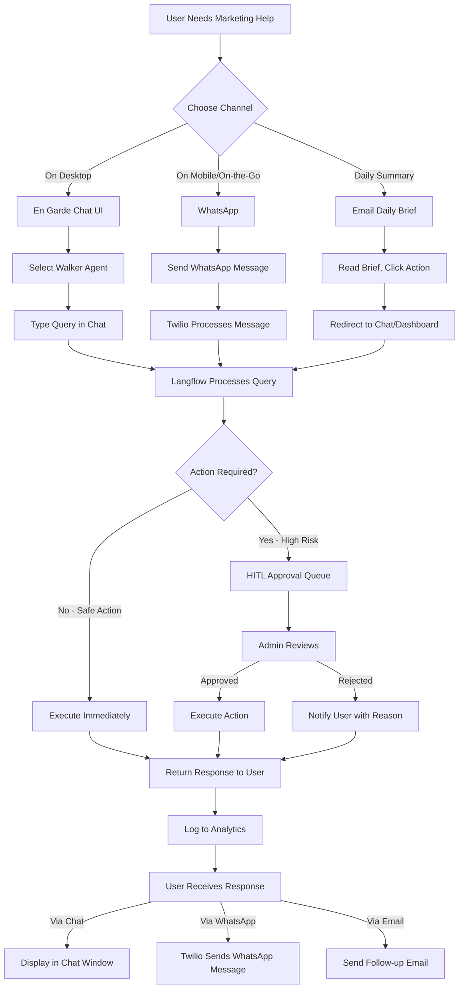
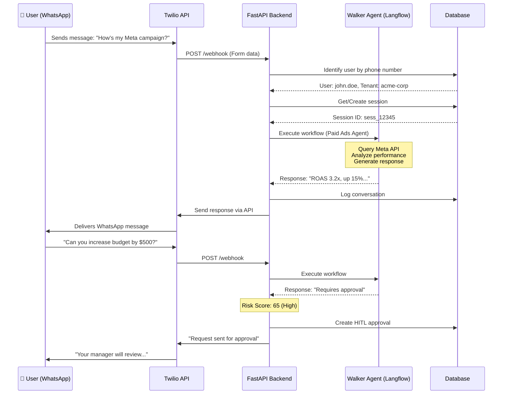
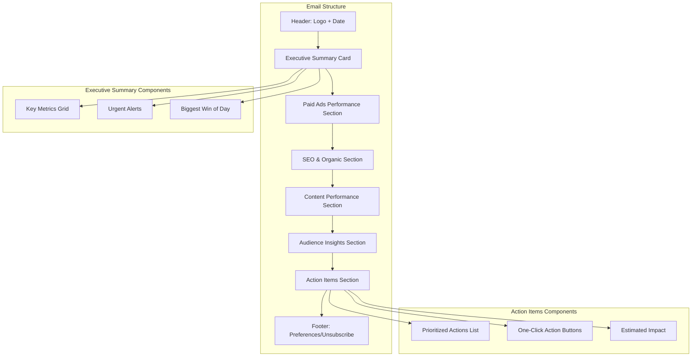
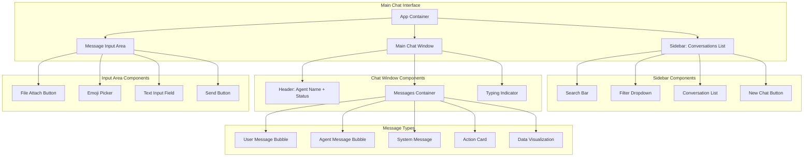
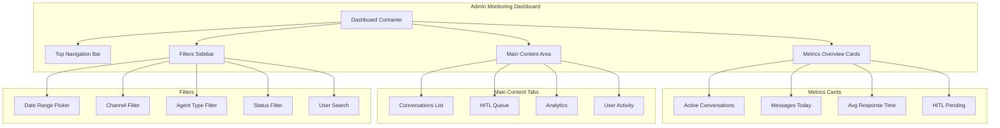
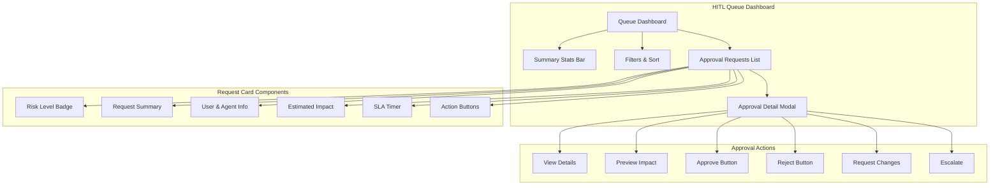
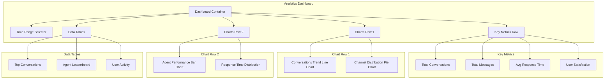
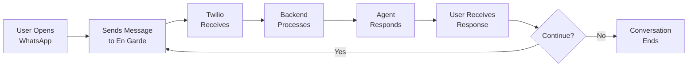

# Walker Agents Communication Channels - Wireframes & Diagrams

**Version:** 1.0
**Last Updated:** December 25, 2025
**Format:** Mermaid Diagrams

---

## Table of Contents

1. [User Journey Wireframes](#user-journey-wireframes)
2. [WhatsApp Conversation Flow](#whatsapp-conversation-flow)
3. [Email Daily Brief Layout](#email-daily-brief-layout)
4. [Chat UI Interface](#chat-ui-interface)
5. [Admin Monitoring Dashboard](#admin-monitoring-dashboard)
6. [HITL Review Queue](#hitl-review-queue)
7. [Analytics Dashboard](#analytics-dashboard)
8. [Mobile Views](#mobile-views)

---

## User Journey Wireframes

### Overall User Journey - All Communication Channels



---

## WhatsApp Conversation Flow

### WhatsApp User Experience Wireframe



### WhatsApp Chat Screen Mockup

```
┌─────────────────────────────────────┐
│ ← Walker Paid Ads Agent      ℹ️ ⋮  │
├─────────────────────────────────────┤
│                                     │
│  How's my Meta campaign?         ◄ │
│                        10:23 AM     │
│                                     │
│ ► Your Meta campaign is performing  │
│   well! Here's the summary:         │
│                                     │
│   📊 ROAS: 3.2x (↑ 15%)            │
│   💰 Spend: $8,234 / $10,000       │
│   👥 Reach: 245K                   │
│   🎯 Conversions: 156              │
│                                     │
│   [View Full Report]                │
│                        10:23 AM     │
│                                     │
│  Can you increase budget by $500? ◄│
│                        10:24 AM     │
│                                     │
│ ► ⚠️ Budget increases require      │
│   approval. I've sent your request  │
│   to your manager.                  │
│                                     │
│   Request ID: #BR-12345             │
│   Est. approval: ~2 hours           │
│                                     │
│   I'll notify you when approved! 🔔 │
│                        10:24 AM     │
│                                     │
├─────────────────────────────────────┤
│ 📎 | Type a message...         🎤 │
└─────────────────────────────────────┘
```

---

## Email Daily Brief Layout

### Email Daily Brief Wireframe



### Email HTML Mockup

```
┌──────────────────────────────────────────────────────────┐
│                     [EN GARDE LOGO]                      │
│              Your Daily Brief - Dec 25, 2025            │
│──────────────────────────────────────────────────────────│
│                                                          │
│  ┌────────────────────────────────────────────────────┐ │
│  │        📊 At a Glance                              │ │
│  ├────────────────────────────────────────────────────┤ │
│  │  ROAS: 3.2x     Traffic: ↑12%    Conversions: 156 │ │
│  │                                                    │ │
│  │  ⚠️ 3 items need your attention                   │ │
│  └────────────────────────────────────────────────────┘ │
│                                                          │
│  ┌────────────────────────────────────────────────────┐ │
│  │  📢 Paid Ads Performance (Paid Ads Agent)         │ │
│  ├────────────────────────────────────────────────────┤ │
│  │  Yesterday's Spend: $1,234 / $1,500 daily budget  │ │
│  │  ROAS Trend (7d): 2.8x → 3.2x (↑ 14%)            │ │
│  │                                                    │ │
│  │  🏆 Top Campaign: "Holiday Sale"                  │ │
│  │     ROAS: 4.5x | Spend: $456 | Conv: 67           │ │
│  │                                                    │ │
│  │  ⚠️ Alert: "Spring Campaign" underperforming      │ │
│  │     ROAS: 1.2x (below 2.0x target)                │ │
│  │     [Pause Campaign] [Adjust Targeting]           │ │
│  └────────────────────────────────────────────────────┘ │
│                                                          │
│  ┌────────────────────────────────────────────────────┐ │
│  │  🔍 SEO & Organic (SEO Agent)                     │ │
│  ├────────────────────────────────────────────────────┤ │
│  │  Ranking Changes:                                  │ │
│  │  • "best marketing software" → #7 (↑3)            │ │
│  │  • "multicultural marketing" → #12 (↓2)           │ │
│  │                                                    │ │
│  │  Top Traffic Page: /blog/ai-marketing-guide       │ │
│  │  Visits: 1,234 | Avg Time: 4:32 | Bounce: 23%    │ │
│  │                                                    │ │
│  │  💡 New Opportunity: "cultural marketing tools"   │ │
│  │     Volume: 5.4K/mo | Difficulty: 45 | Current: - │ │
│  │     [Create Content Brief]                         │ │
│  └────────────────────────────────────────────────────┘ │
│                                                          │
│  ┌────────────────────────────────────────────────────┐ │
│  │  ✍️ Content Performance (Content Gen Agent)       │ │
│  ├────────────────────────────────────────────────────┤ │
│  │  Top Social Post (Instagram):                      │ │
│  │  "5 Tips for Multicultural Marketing"             │ │
│  │  Engagement: 1.2K | Reach: 23K | Saves: 234       │ │
│  │                                                    │ │
│  │  Email Newsletter (Yesterday):                     │ │
│  │  Open: 58% (↑5%) | CTR: 12% (↑2%)                │ │
│  │                                                    │ │
│  │  💡 Content Ideas for Today:                      │ │
│  │  • "How AI is changing content marketing"         │ │
│  │  • "Lunar New Year campaign examples"             │ │
│  │  [Generate Content]                                │ │
│  └────────────────────────────────────────────────────┘ │
│                                                          │
│  ┌────────────────────────────────────────────────────┐ │
│  │  👥 Audience Insights (Audience Intelligence)     │ │
│  ├────────────────────────────────────────────────────┤ │
│  │  🎯 New Segment Discovered:                       │ │
│  │     "High-Value Hispanic Millennials"             │ │
│  │     Size: 2,345 | Avg LTV: $890 | Purchase: 3.2x │ │
│  │     [Create Campaign] [View Details]               │ │
│  │                                                    │ │
│  │  ⚠️ Churn Risk Alert: 45 customers               │ │
│  │     Last purchase: >60 days                        │ │
│  │     [Send Re-engagement Campaign]                  │ │
│  │                                                    │ │
│  │  🔥 High Activity: 12 VIP customers               │ │
│  │     Recent purchases: $12,345 total                │ │
│  │     [Send Thank You Note]                          │ │
│  └────────────────────────────────────────────────────┘ │
│                                                          │
│  ┌────────────────────────────────────────────────────┐ │
│  │  ✅ Recommended Actions (Priority Order)          │ │
│  ├────────────────────────────────────────────────────┤ │
│  │  1. Pause underperforming "Spring Campaign"       │ │
│  │     Impact: Save $200/day | Difficulty: Easy       │ │
│  │     [Pause Now] [Optimize First]                   │ │
│  │                                                    │ │
│  │  2. Create content for "cultural marketing tools" │ │
│  │     Impact: +5.4K monthly visits | Difficulty: Med │ │
│  │     [Generate Brief] [Schedule]                    │ │
│  │                                                    │ │
│  │  3. Send re-engagement to 45 at-risk customers    │ │
│  │     Impact: Recover ~$4,500 revenue | Difficulty:  │ │
│  │     [Generate Email] [Review Segment]              │ │
│  └────────────────────────────────────────────────────┘ │
│                                                          │
│  ──────────────────────────────────────────────────────  │
│  Manage Preferences | Unsubscribe                       │
│  © 2025 En Garde. All rights reserved.                  │
└──────────────────────────────────────────────────────────┘
```

---

## Chat UI Interface

### Chat Window Component Diagram



### Chat UI Desktop Mockup

```
┌──────────────────────────────────────────────────────────────────────┐
│  En Garde Chat                                    [_] [□] [X]        │
├──────────────────────────────────────────────────────────────────────┤
│ ┌────────────────┐ ┌──────────────────────────────────────────────┐ │
│ │                │ │  💼 Paid Ads Marketing Agent          [i] [⋮]│ │
│ │   SIDEBAR      │ │  Status: Online • Avg Response: 1.2s         │ │
│ │                │ ├──────────────────────────────────────────────┤ │
│ │ 🔍 Search...   │ │                                              │ │
│ │ [All ▼]        │ │  What is my current ROAS?             ◄─You │ │
│ │                │ │                                    10:23 AM  │ │
│ │ Recent Chats   │ │                                              │ │
│ │                │ │ Agent─► Let me check your Meta and Google   │ │
│ │ 💼 Campaign    │ │         campaigns...                         │ │
│ │ Planning       │ │                                              │ │
│ │ • 3 new        │ │         Your overall ROAS across platforms:  │ │
│ │ • 2m ago       │ │                                              │ │
│ │                │ │         ┌─────────────────────────────────┐ │ │
│ │ 🔍 SEO         │ │         │  Platform    ROAS    Trend      │ │ │
│ │ Strategy       │ │         │  Meta        3.2x    ↑ 15%     │ │ │
│ │ • 1h ago       │ │         │  Google Ads  2.8x    ↑ 8%      │ │ │
│ │                │ │         │  TikTok      4.1x    ↑ 23%     │ │ │
│ │ ✍️ Content     │ │         │  LinkedIn    1.9x    ↓ 5%      │ │ │
│ │ Ideas          │ │         └─────────────────────────────────┘ │ │
│ │ • Yesterday    │ │                                              │ │
│ │                │ │         [View Detailed Report]               │ │
│ │ 👥 Audience    │ │                                    10:23 AM  │ │
│ │ Segmentation   │ │                                              │ │
│ │ • 2 days ago   │ │  Can you increase Meta budget by $500?  ◄─  │ │
│ │                │ │                                    10:24 AM  │ │
│ │                │ │                                              │ │
│ │ Archived       │ │ Agent─► ⚠️ This action requires approval.   │ │
│ │ • 15 chats     │ │                                              │ │
│ │                │ │         I've created an approval request     │ │
│ │                │ │         for your manager:                    │ │
│ │ [+ New Chat]   │ │                                              │ │
│ │                │ │         Request: #BR-12345                   │ │
│ │                │ │         Approver: Jane Smith                 │ │
│ │                │ │         Est. Time: ~2 hours                  │ │
│ │                │ │                                              │ │
│ │                │ │         I'll notify you when approved! 🔔    │ │
│ │                │ │                                    10:24 AM  │ │
│ │                │ │                                              │ │
│ │                │ │ Agent is typing...                           │ │
│ └────────────────┘ └──────────────────────────────────────────────┘ │
│                    ┌──────────────────────────────────────────────┐ │
│                    │ 📎 😊  Type a message...            [Send ►]│ │
│                    └──────────────────────────────────────────────┘ │
└──────────────────────────────────────────────────────────────────────┘
```

### Chat UI Mobile View

```
┌────────────────────────────┐
│ ← Paid Ads Agent      ℹ️ ⋮ │
├────────────────────────────┤
│                            │
│ What is my current ROAS? ◄│
│               10:23 AM     │
│                            │
│► Let me check...           │
│                            │
│  ┌──────────────────────┐ │
│  │ Platform     ROAS    │ │
│  │ Meta         3.2x ↑  │ │
│  │ Google Ads   2.8x ↑  │ │
│  │ TikTok       4.1x ↑  │ │
│  │ LinkedIn     1.9x ↓  │ │
│  └──────────────────────┘ │
│                            │
│  [View Report]             │
│               10:23 AM     │
│                            │
│ Increase Meta by $500?   ◄│
│               10:24 AM     │
│                            │
│► ⚠️ Requires approval      │
│                            │
│  Request: #BR-12345        │
│  Approver: Jane Smith      │
│  Est: ~2 hours 🔔          │
│               10:24 AM     │
│                            │
├────────────────────────────┤
│ Type a message...   📎 [>]│
└────────────────────────────┘
```

---

## Admin Monitoring Dashboard

### Admin Dashboard Component Structure



### Admin Dashboard Mockup

```
┌────────────────────────────────────────────────────────────────────────┐
│  🛡️ Admin Monitoring Dashboard              john.admin@engarde.com ▼  │
├────────────────────────────────────────────────────────────────────────┤
│  [Conversations] [HITL Queue] [Analytics] [Users] [Settings]           │
├────────────────────────────────────────────────────────────────────────┤
│  ┌───────────┐ ┌───────────┐ ┌───────────┐ ┌───────────┐            │
│  │Active     │ │Messages   │ │Avg Time   │ │HITL       │            │
│  │Convs      │ │Today      │ │           │ │Pending    │            │
│  │   234     │ │  4,521    │ │   1.2s    │ │    12     │            │
│  │  ↑ 12%    │ │  ↑ 8%     │ │  ↓ 0.3s   │ │  ⚠️       │            │
│  └───────────┘ └───────────┘ └───────────┘ └───────────┘            │
├────────────────────────────────────────────────────────────────────────┤
│  ┌──────────┐  ┌────────────────────────────────────────────────────┐│
│  │FILTERS   │  │  Conversations Monitoring                          ││
│  │          │  │  [Search: type to filter...]         [Export CSV]  ││
│  │Date Range│  ├────────────────────────────────────────────────────┤│
│  │[Last 7d▼]│  │  ┌──────┬─────────┬─────────┬───────┬────────┬───┐││
│  │          │  │  │ User │ Channel │  Agent  │ Msgs  │ Last   │Act│││
│  │Channel   │  │  ├──────┼─────────┼─────────┼───────┼────────┼───┤││
│  │☑WhatsApp │  │  │John  │WhatsApp │Paid Ads │  23   │2m ago  │ 👁️│││
│  │☑Chat UI  │  │  │Sarah │Chat UI  │SEO      │  45   │10m ago │ 👁️│││
│  │☐Email    │  │  │Mike  │Email    │Content  │  12   │1h ago  │ 👁️│││
│  │          │  │  │Lisa  │WhatsApp │Audience │   8   │3h ago  │ 👁️│││
│  │Agent     │  │  │Tom   │Chat UI  │Paid Ads │  67   │5h ago  │ 👁️│││
│  │☑Paid Ads │  │  │Emma  │WhatsApp │SEO      │  34   │1d ago  │ 👁️│││
│  │☑SEO      │  │  └──────┴─────────┴─────────┴───────┴────────┴───┘││
│  │☑Content  │  │                                   [1] 2 3 ... 42   ││
│  │☑Audience │  └────────────────────────────────────────────────────┘│
│  │          │                                                         │
│  │Status    │                                                         │
│  │☑Active   │                                                         │
│  │☑Archived │                                                         │
│  │          │                                                         │
│  │Privacy   │                                                         │
│  │☐Show PII │                                                         │
│  │☑Mask Data│                                                         │
│  │☑Log      │                                                         │
│  │ Access   │                                                         │
│  └──────────┘                                                         │
└────────────────────────────────────────────────────────────────────────┘
```

### Conversation Detail View Mockup

```
┌────────────────────────────────────────────────────────────────────────┐
│  ← Back to Conversations                                               │
├────────────────────────────────────────────────────────────────────────┤
│  Conversation Details: John Doe - Paid Ads Marketing Agent             │
├────────────────────────────────────────────────────────────────────────┤
│  ┌──────────────────────────────────────────────────────────────────┐ │
│  │ User Information                                                 │ │
│  │ Name: John Doe                                                   │ │
│  │ Email: j***@example.com (masked)                [Show Full PII] │ │
│  │ Phone: +1-***-***-1234 (masked)                                  │ │
│  │ Tenant: Acme Corp                                                │ │
│  │ User Since: Jan 15, 2025                                         │ │
│  └──────────────────────────────────────────────────────────────────┘ │
│                                                                        │
│  ┌──────────────────────────────────────────────────────────────────┐ │
│  │ Conversation Metadata                                            │ │
│  │ Channel: WhatsApp                 Started: Dec 24, 2:30 PM       │ │
│  │ Agent: Paid Ads Marketing         Ended: Dec 24, 3:45 PM         │ │
│  │ Messages: 23                      Duration: 1h 15m               │ │
│  │ Status: Completed                 CSAT: ⭐⭐⭐⭐⭐ (5/5)          │ │
│  └──────────────────────────────────────────────────────────────────┘ │
│                                                                        │
│  ┌──────────────────────────────────────────────────────────────────┐ │
│  │ Conversation Thread                       [Export] [Flag]       │ │
│  ├──────────────────────────────────────────────────────────────────┤ │
│  │                                                                  │ │
│  │ [2:30 PM] User:                                                  │ │
│  │ "How's my Meta campaign performing?"                             │ │
│  │                                                                  │ │
│  │ [2:31 PM] Paid Ads Agent:                                        │ │
│  │ "Your Meta campaign has a ROAS of 3.2x (up 15% from last week).│ │
│  │  Here's the breakdown:                                           │ │
│  │  • Spend: $8,234 / $10,000 monthly budget                       │ │
│  │  • Reach: 245,000 people                                         │ │
│  │  • Conversions: 156 (cost per conv: $52.78)                     │ │
│  │  [View Full Report]"                                             │ │
│  │                                                                  │ │
│  │ [2:32 PM] User:                                                  │ │
│  │ "Great! Can we target more Hispanic audiences?"                  │ │
│  │                                                                  │ │
│  │ [2:33 PM] Paid Ads Agent:                                        │ │
│  │ "Absolutely! I recommend creating a custom audience segment...   │ │
│  │  [Long response with recommendations]                            │ │
│  │                                                                  │ │
│  │ [2:35 PM] User:                                                  │ │
│  │ "Sounds good. Can you increase the budget by $500?"              │ │
│  │                                                                  │ │
│  │ [2:35 PM] Paid Ads Agent:                                        │ │
│  │ "⚠️ Budget increases require manager approval. I've created an   │ │
│  │  approval request:                                               │ │
│  │  • Request ID: #BR-12345                                         │ │
│  │  • Approver: Jane Smith (Marketing Manager)                      │ │
│  │  • Estimated approval time: ~2 hours                             │ │
│  │  [View Request Details]"                                         │ │
│  │  ───────────────────────────────────────────                    │ │
│  │  ⚡ HITL Request Created: #BR-12345                             │ │
│  │  Risk Level: Medium (55/100)                                     │ │
│  │  Status: Pending Approval                                        │ │
│  │  [Go to HITL Queue]                                              │ │
│  │  ───────────────────────────────────────────                    │ │
│  │                                                                  │ │
│  │ [...18 more messages...]                                         │ │
│  │                                                                  │ │
│  │ [3:45 PM] System:                                                │ │
│  │ "✅ Budget increase approved by Jane Smith"                      │ │
│  │                                                                  │ │
│  │ [3:45 PM] Paid Ads Agent:                                        │ │
│  │ "Great news! Your budget increase has been approved and          │ │
│  │  implemented. New budget: $10,500/month"                         │ │
│  │                                                                  │ │
│  └──────────────────────────────────────────────────────────────────┘ │
│                                                                        │
│  ┌──────────────────────────────────────────────────────────────────┐ │
│  │ Actions Performed                                                │ │
│  │ • Budget Increase: $10,000 → $10,500 (Approved)                 │ │
│  │ • Campaign Analysis: Meta Ads (Completed)                        │ │
│  │ • Audience Recommendation: Hispanic Segment (Generated)          │ │
│  └──────────────────────────────────────────────────────────────────┘ │
│                                                                        │
│  ┌──────────────────────────────────────────────────────────────────┐ │
│  │ Admin Notes & Flags                          [Add Note]         │ │
│  │ No notes or flags for this conversation.                         │ │
│  └──────────────────────────────────────────────────────────────────┘ │
│                                                                        │
│  ┌──────────────────────────────────────────────────────────────────┐ │
│  │ Audit Log                                                        │ │
│  │ • 2025-12-24 14:30:00 - Conversation started                     │ │
│  │ • 2025-12-24 14:35:12 - HITL approval created (#BR-12345)        │ │
│  │ • 2025-12-24 15:22:45 - Admin view (jane.smith@acme.com)        │ │
│  │ • 2025-12-24 15:23:10 - Approval granted (jane.smith@acme.com)  │ │
│  │ • 2025-12-24 15:45:33 - Conversation ended                       │ │
│  │ • 2025-12-25 10:30:00 - Admin view (john.admin@engarde.com)     │ │
│  └──────────────────────────────────────────────────────────────────┘ │
└────────────────────────────────────────────────────────────────────────┘
```

---

## HITL Review Queue

### HITL Queue Interface Wireframe



### HITL Queue Mockup

```
┌────────────────────────────────────────────────────────────────────────┐
│  🔐 HITL Approval Queue                                                │
├────────────────────────────────────────────────────────────────────────┤
│  ┌──────────────────────────────────────────────────────────────────┐ │
│  │ Pending: 12    Approved Today: 45    Rejected: 3    SLA: 96.8% │ │
│  └──────────────────────────────────────────────────────────────────┘ │
├────────────────────────────────────────────────────────────────────────┤
│  Filters: [All Risk ▼] [All Actions ▼] [My Assignments ▼] [Sort: SLA▼]│
├────────────────────────────────────────────────────────────────────────┤
│                                                                        │
│  ┌──────────────────────────────────────────────────────────────────┐ │
│  │ 🔴 HIGH RISK • Budget Increase Request • #BR-12345              │ │
│  ├──────────────────────────────────────────────────────────────────┤ │
│  │ User: john.doe@example.com                        Risk: 75/100   │ │
│  │ Agent: Paid Ads Marketing Agent                                  │ │
│  │ Requested: 15 minutes ago          SLA: ⏱️ 1h 45m remaining     │ │
│  │                                                                  │ │
│  │ Action Details:                                                  │ │
│  │ Increase Meta Ads budget: $10,000/mo → $15,000/mo (+$5,000)    │ │
│  │                                                                  │ │
│  │ Estimated Impact:                                                │ │
│  │ • Reach: +40% (245K → 343K)                                     │ │
│  │ • Projected ROAS: 3.5x (based on historical data)               │ │
│  │ • Cost/Conversion: $52 → $48 (optimized)                        │ │
│  │                                                                  │ │
│  │ Risk Factors:                                                    │ │
│  │ • Large budget increase (50% jump)                               │ │
│  │ • Mid-month change (may affect monthly planning)                │ │
│  │                                                                  │ │
│  │ User Note: "Holiday campaign performing well, want to scale"     │ │
│  │                                                                  │ │
│  │ [View Full Details] [✓ Approve] [✕ Reject] [⬆ Escalate]        │ │
│  └──────────────────────────────────────────────────────────────────┘ │
│                                                                        │
│  ┌──────────────────────────────────────────────────────────────────┐ │
│  │ 🟡 MEDIUM RISK • Campaign Publish • #CP-45678                   │ │
│  ├──────────────────────────────────────────────────────────────────┤ │
│  │ User: sarah.jones@example.com                     Risk: 45/100   │ │
│  │ Agent: Content Generation Agent                                  │ │
│  │ Requested: 1 hour ago              SLA: ⏱️ 23h remaining         │ │
│  │                                                                  │ │
│  │ Action Details:                                                  │ │
│  │ Publish 15 social media posts to Instagram (10) and TikTok (5)  │ │
│  │                                                                  │ │
│  │ Estimated Impact:                                                │ │
│  │ • Reach: ~250K impressions                                       │ │
│  │ • Platforms: Instagram, TikTok                                   │ │
│  │ • Topics: Holiday sale, product features, brand story            │ │
│  │                                                                  │ │
│  │ Content Preview:                                                 │ │
│  │ [Post 1: "🎄 Holiday Sale..."] [Post 2: "New features..."]      │ │
│  │ [View All 15 Posts]                                              │ │
│  │                                                                  │ │
│  │ [View Full Details] [✓ Approve] [✕ Reject] [📝 Request Changes]│ │
│  └──────────────────────────────────────────────────────────────────┘ │
│                                                                        │
│  ┌──────────────────────────────────────────────────────────────────┐ │
│  │ 🟢 LOW RISK • SEO Content Brief • #SEO-23456                    │ │
│  ├──────────────────────────────────────────────────────────────────┤ │
│  │ User: mike.chen@example.com                       Risk: 25/100   │ │
│  │ Agent: SEO Agent                                                 │ │
│  │ Requested: 3 hours ago             SLA: ⏱️ 21h remaining         │ │
│  │                                                                  │ │
│  │ Action Details:                                                  │ │
│  │ Create SEO content brief for "cultural marketing tools"          │ │
│  │                                                                  │ │
│  │ Estimated Impact:                                                │ │
│  │ • Keyword Volume: 5,400/month                                    │ │
│  │ • Difficulty: 45 (Medium)                                        │ │
│  │ • Est. Traffic: +2,700 monthly visits                            │ │
│  │                                                                  │ │
│  │ [View Full Details] [✓ Approve] [✕ Reject]                      │ │
│  └──────────────────────────────────────────────────────────────────┘ │
│                                                                        │
│  [Load More] [1] 2 3 ... 5                                            │
└────────────────────────────────────────────────────────────────────────┘
```

### HITL Approval Detail Modal

```
┌────────────────────────────────────────────────────────────────────────┐
│  Budget Increase Request - #BR-12345                            [✕]   │
├────────────────────────────────────────────────────────────────────────┤
│  ┌──────────────────────────────────────────────────────────────────┐ │
│  │ Risk Assessment                              🔴 HIGH (75/100)   │ │
│  └──────────────────────────────────────────────────────────────────┘ │
│                                                                        │
│  ┌──────────────────────────────────────────────────────────────────┐ │
│  │ Requestor Information                                            │ │
│  │ Name: John Doe                                                   │ │
│  │ Email: john.doe@example.com                                      │ │
│  │ Role: Marketing Manager                                          │ │
│  │ Tenant: Acme Corp                                                │ │
│  │ Previous Requests: 23 (21 approved, 2 rejected)                  │ │
│  └──────────────────────────────────────────────────────────────────┘ │
│                                                                        │
│  ┌──────────────────────────────────────────────────────────────────┐ │
│  │ Action Details                                                   │ │
│  │ Type: Budget Increase                                            │ │
│  │ Agent: Paid Ads Marketing Agent                                  │ │
│  │ Platform: Meta Ads (Facebook & Instagram)                        │ │
│  │                                                                  │ │
│  │ Current Budget: $10,000/month                                    │ │
│  │ Proposed Budget: $15,000/month                                   │ │
│  │ Increase: +$5,000/month (50%)                                    │ │
│  │ Annual Impact: +$60,000/year                                     │ │
│  └──────────────────────────────────────────────────────────────────┘ │
│                                                                        │
│  ┌──────────────────────────────────────────────────────────────────┐ │
│  │ Estimated Impact Analysis                                        │ │
│  │ ┌────────────────────┬────────────┬────────────┬───────────────┐│ │
│  │ │ Metric             │ Current    │ Projected  │ Change        ││ │
│  │ ├────────────────────┼────────────┼────────────┼───────────────┤│ │
│  │ │ Monthly Spend      │ $10,000    │ $15,000    │ +$5,000 (50%)││ │
│  │ │ Reach              │ 245,000    │ 343,000    │ +98K (40%)   ││ │
│  │ │ Conversions        │ 156        │ 234        │ +78 (50%)    ││ │
│  │ │ Cost/Conversion    │ $64.10     │ $64.10     │ Maintained   ││ │
│  │ │ ROAS               │ 3.2x       │ 3.5x       │ +0.3x        ││ │
│  │ │ Revenue Impact     │ $32,000    │ $52,500    │ +$20,500     ││ │
│  │ └────────────────────┴────────────┴────────────┴───────────────┘│ │
│  │                                                                  │ │
│  │ ROI Calculation: $20,500 revenue / $5,000 spend = 4.1x          │ │
│  │ Payback Period: ~7 days                                          │ │
│  └──────────────────────────────────────────────────────────────────┘ │
│                                                                        │
│  ┌──────────────────────────────────────────────────────────────────┐ │
│  │ Risk Factors                                                     │ │
│  │ 🔴 Large budget increase (50% jump) - High risk                 │ │
│  │ 🟡 Mid-month change may affect planning - Medium risk           │ │
│  │ 🟢 Strong historical performance (3.2x ROAS) - Mitigating       │ │
│  │ 🟢 Holiday season timing optimal - Mitigating                   │ │
│  │                                                                  │ │
│  │ Overall Risk Score: 75/100 (High)                                │ │
│  │ Recommendation: Approve with monitoring                          │ │
│  └──────────────────────────────────────────────────────────────────┘ │
│                                                                        │
│  ┌──────────────────────────────────────────────────────────────────┐ │
│  │ User Justification                                               │ │
│  │ "Our holiday campaign is performing exceptionally well. We're    │ │
│  │  seeing 3.2x ROAS and have strong demand. Want to scale while    │ │
│  │  the opportunity is hot. Historical data shows we can maintain   │ │
│  │  or improve performance at this scale."                          │ │
│  └──────────────────────────────────────────────────────────────────┘ │
│                                                                        │
│  ┌──────────────────────────────────────────────────────────────────┐ │
│  │ Compliance Checks                                                │ │
│  │ ✅ Within approved budget authority (<$25K)                      │ │
│  │ ✅ No regulatory concerns                                        │ │
│  │ ✅ Brand guidelines compliance                                   │ │
│  │ ⚠️ Requires director approval (>$5K monthly increase)            │ │
│  └──────────────────────────────────────────────────────────────────┘ │
│                                                                        │
│  ┌──────────────────────────────────────────────────────────────────┐ │
│  │ SLA & Timeline                                                   │ │
│  │ Requested: 15 minutes ago (2:35 PM)                              │ │
│  │ SLA Deadline: 4:35 PM (2 hours)                 ⏱️ 1h 45m left  │ │
│  │ Current Approver: You (Marketing Director)                       │ │
│  │ Next Level: CFO (if escalated)                                   │ │
│  └──────────────────────────────────────────────────────────────────┘ │
│                                                                        │
│  ┌──────────────────────────────────────────────────────────────────┐ │
│  │ Your Decision                                                    │ │
│  │                                                                  │ │
│  │ Approval Notes (optional):                                       │ │
│  │ ┌──────────────────────────────────────────────────────────────┐│ │
│  │ │ Approved. Strong performance justifies scaling. Monitor      ││ │
│  │ │ daily for first week to ensure ROAS maintains.               ││ │
│  │ └──────────────────────────────────────────────────────────────┘│ │
│  │                                                                  │ │
│  │ [✓ Approve & Execute] [✕ Reject] [⬆ Escalate to CFO]           │ │
│  │ [💬 Request More Info] [Cancel]                                 │ │
│  └──────────────────────────────────────────────────────────────────┘ │
└────────────────────────────────────────────────────────────────────────┘
```

---

## Analytics Dashboard

### Analytics Dashboard Structure



### Analytics Dashboard Mockup

```
┌────────────────────────────────────────────────────────────────────────┐
│  📊 Walker Agents Analytics                    [Last 30 Days ▼]       │
├────────────────────────────────────────────────────────────────────────┤
│  ┌───────────┐ ┌───────────┐ ┌───────────┐ ┌───────────┐            │
│  │Total      │ │Messages   │ │Avg Time   │ │CSAT       │            │
│  │Convs      │ │           │ │           │ │           │            │
│  │  2,543    │ │  45,821   │ │   1.2s    │ │  4.7/5.0  │            │
│  │  ↑ 12%    │ │  ↑ 18%    │ │  ↓ 0.3s   │ │  ↑ 0.2    │            │
│  └───────────┘ └───────────┘ └───────────┘ └───────────┘            │
├────────────────────────────────────────────────────────────────────────┤
│  ┌──────────────────────────────┐ ┌──────────────────────────────────┐│
│  │ Conversations per Day        │ │ Channel Distribution             ││
│  │ ┌───────────────────────────┐│ │ ┌───────────────────────────────┐││
│  │ │                       ╱╲  ││ │ │        📱 WhatsApp: 45%       │││
│  │ │                   ╱╲ ╱  ╲ ││ │ │        💬 Chat UI: 38%        │││
│  │ │               ╱╲ ╱  V    V││ │ │        📧 Email: 17%          │││
│  │ │   ╱╲     ╱╲ ╱  V          ││ │ │                               │││
│  │ │  ╱  ╲───╱  V              ││ │ │    [Pie Chart Visualization]  │││
│  │ │ ╱                         ││ │ │                               │││
│  │ └───────────────────────────┘│ │ └───────────────────────────────┘││
│  │ Dec 1      Dec 15     Dec 30 │ │                                  ││
│  └──────────────────────────────┘ └──────────────────────────────────┘│
├────────────────────────────────────────────────────────────────────────┤
│  ┌──────────────────────────────┐ ┌──────────────────────────────────┐│
│  │ Agent Performance            │ │ Response Time Distribution       ││
│  │ ┌───────────────────────────┐│ │ ┌───────────────────────────────┐││
│  │ │ Paid Ads     ████████ 892 ││ │ │ <1s   ███████████████ 89%    │││
│  │ │ SEO          ██████ 654   ││ │ │ 1-3s  ███ 8%                 │││
│  │ │ Content      ███████ 721  ││ │ │ 3-5s  █ 2%                   │││
│  │ │ Audience     ███ 276      ││ │ │ >5s   █ 1%                   │││
│  │ └───────────────────────────┘│ │ └───────────────────────────────┘││
│  └──────────────────────────────┘ └──────────────────────────────────┘│
├────────────────────────────────────────────────────────────────────────┤
│  Top Conversations by Engagement                          [View All]   │
│  ┌────────┬─────────┬──────────┬────────┬──────┬────────────────────┐│
│  │ User   │ Agent   │ Channel  │ Msgs   │ Time │ Outcome            ││
│  ├────────┼─────────┼──────────┼────────┼──────┼────────────────────┤│
│  │ John   │Paid Ads │WhatsApp  │  67    │ 2.5h │Budget increased    ││
│  │ Sarah  │SEO      │Chat UI   │  45    │ 1.8h │Content brief       ││
│  │ Mike   │Content  │Email     │  34    │ 0.5h │Posts generated     ││
│  │ Emma   │Audience │WhatsApp  │  29    │ 1.2h │Segment created     ││
│  │ Tom    │Paid Ads │Chat UI   │  23    │ 0.8h │Campaign optimized  ││
│  └────────┴─────────┴──────────┴────────┴──────┴────────────────────┘│
├────────────────────────────────────────────────────────────────────────┤
│  HITL Approval Analytics                                  [View Queue] │
│  ┌──────────────────────────────────────────────────────────────────┐ │
│  │ Pending: 12        Approved: 234       Rejected: 18             │ │
│  │ Avg Approval Time: 2.3 hours          SLA Compliance: 96.8%     │ │
│  │                                                                  │ │
│  │ By Risk Level:                                                   │ │
│  │ Low (0-30):     156 ████████                                    │ │
│  │ Medium (31-60):  78 ████                                        │ │
│  │ High (61-85):    18 █                                           │ │
│  │ Critical (86+):   0                                             │ │
│  └──────────────────────────────────────────────────────────────────┘ │
└────────────────────────────────────────────────────────────────────────┘
```

---

## Mobile Views

### WhatsApp Mobile Flow



### Chat UI Mobile Mockup

```
┌────────────────────────────┐
│ ≡  En Garde Chat       👤  │
├────────────────────────────┤
│ 💼 Paid Ads Agent          │
│ Status: Online • 1.2s avg  │
├────────────────────────────┤
│                            │
│ What's my ROAS?          ◄│
│            10:23 AM        │
│                            │
│► Your overall ROAS:        │
│                            │
│  Platform    ROAS          │
│  ───────────────────       │
│  Meta        3.2x ↑        │
│  Google      2.8x ↑        │
│  TikTok      4.1x ↑        │
│  LinkedIn    1.9x ↓        │
│                            │
│  [View Report]             │
│            10:23 AM        │
│                            │
│ Increase Meta by $500?   ◄│
│            10:24 AM        │
│                            │
│► ⚠️ Requires approval      │
│                            │
│  Request: #BR-12345        │
│  Approver: Jane Smith      │
│  Est: ~2 hours             │
│                            │
│  I'll notify you! 🔔       │
│            10:24 AM        │
│                            │
│░░░ Agent is typing... ░░░  │
│                            │
├────────────────────────────┤
│ 📎  Type message...  [►]  │
└────────────────────────────┘

[Tap to expand keyboard]
```

### Admin Dashboard Mobile View

```
┌────────────────────────────┐
│ ≡  Admin Dashboard     👤  │
├────────────────────────────┤
│ [Convs][HITL][Analytics]   │
├────────────────────────────┤
│                            │
│ ┌────────┐ ┌────────┐     │
│ │Active  │ │Pending │     │
│ │  234   │ │   12   │     │
│ │ ↑ 12%  │ │  ⚠️    │     │
│ └────────┘ └────────┘     │
│                            │
│ ┌────────┐ ┌────────┐     │
│ │Messages│ │Avg Time│     │
│ │ 4,521  │ │  1.2s  │     │
│ │ ↑ 8%   │ │ ↓ 0.3s │     │
│ └────────┘ └────────┘     │
├────────────────────────────┤
│ Recent Conversations       │
│ [Search...]        [Filter]│
│                            │
│ ┌──────────────────────────┤
│ │ John • WhatsApp          │
│ │ Paid Ads • 23 msgs       │
│ │ 2m ago            [View] │
│ ├──────────────────────────┤
│ │ Sarah • Chat UI          │
│ │ SEO • 45 msgs            │
│ │ 10m ago           [View] │
│ ├──────────────────────────┤
│ │ Mike • Email             │
│ │ Content • 12 msgs        │
│ │ 1h ago            [View] │
│ └──────────────────────────┘
│                            │
│ [Load More]                │
└────────────────────────────┘
```

---

## Sequence Diagrams (See Next Section)

Detailed sequence diagrams for key flows are documented in the Architecture Diagrams document.

---

**Document Version:** 1.0
**Last Updated:** December 25, 2025
**Next Review:** January 25, 2026
**Maintained By:** Product & Design Team
